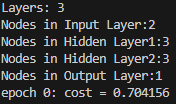
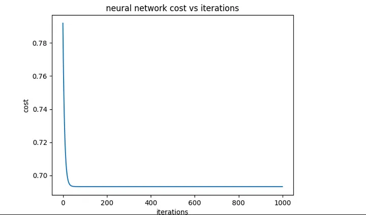

# Neural Network from Scratch with only Numpy

Following the Blog Post by Aadil Mallick 

https://medium.com/@waadlingaadil/learn-to-build-a-neural-network-from-scratch-yes-really-cac4ca457efc

From a hardcoded neural network to a generalized network to work with any amount of layers and any amount of nodes in the hidden layers. 

Test costs

Neural Network cost vs iterations

